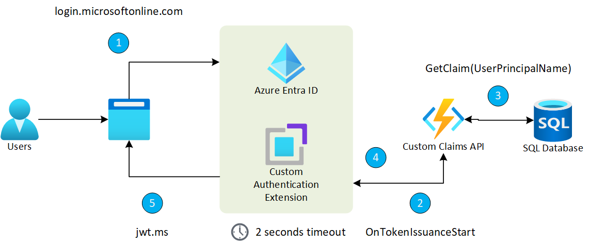

# Custom Claims Provider implementation

This is a sample Azure function implementation of a [custom claims provider](https://learn.microsoft.com/en-us/entra/identity-platform/custom-extension-tokenissuancestart-configuration?tabs=azure-portal%2Cworkforce-tenant) that lisents for the token isuance start event.

The function calls an Azure SQL database to read the custom claims by user principal name.

## How to setup

### Configure Custom Authentication Extension

Follow the official [Configure a custom claim provider for a token issuance start event](https://learn.microsoft.com/en-us/entra/identity-platform/custom-extension-tokenissuancestart-configuration?tabs=azure-portal%2Cworkforce-tenant) documentation and keep the Client Id of the app registration for later use.

You can view the setup process in this [link](https://www.youtube.com/watch?v=fxQGVIwX8_4&list=PL3ZTgFEc7Lythpts59O9KOVuEDLWJLLmA&index=7).

### CustomUserClaims SQL Table

This example uses an Azure SQL Database to store the custom claims. To create the SQL Table on your prefered Azure SQL Database instance run the `./SQLScripts/CustomUserClaims.sql` file inside SQL Server Management Studio, Query Editor in Azure portal or your prefered SQL client.

There is also a `./SQLScripts/User.sql` file with basic inserts to the CustomUserClaims table, you'll need to provide the User Principal Name used when authenticating, this usually has the format of user@doamin.com.

### Running the service

Configure the environment variables or add these into your `local.settings.json` file:

- `AuthenticationTenantId` - Tenant id of the app registrations.
- `AuthenticationClientId` - Client id representing this application.
- `SqlConnectionString` - Connection string of the Azure SQL Database hosting the CustomUserClaims table.

Run the Azure function locally or deploy into Azure. To run locally do `dotnet build` and then `func host start --verbose`.

### Use devtunnel for local testing

For local testing use [devtunnel](https://learn.microsoft.com/en-us/azure/developer/dev-tunnels/get-started?tabs=windows) cli to expose your `http://localhost:7071` endpoint to Entra Id. Dev tunnels is a powerful tool to securely open your localhost to the internet and control who has access. 

Once devtunnel is installed you'll need to login `devtunnel user login` and run `devtunnel host -p 7071` in a terminal.

### Warm up the service

Entra Id Custom Authentication extension has a timeout of 2 second, to avoid error during the authenticatoin proces you can warm up the SQL connection by doing a GET call on the `http://<localhost or domain name>/api/Warmup` endpoint. If the warm up is not done the first login attempt will fail, subsequent calls should succeed.

### Testing 

Open a new private browser and sign-in through the following URL: `https://login.microsoftonline.com/{tenantId}/oauth2/v2.0/authorize?client_id={App_to_enrich_ID}&response_type=id_token&redirect_uri=https://jwt.ms&scope=openid&state=12345&nonce=12345`. Replace {tenantId} with your tenant ID, tenant name, or one of your verified domain names. For example, contoso.onmicrosoft.com. Also replace {App_to_enrich_ID} with the test application client ID.

